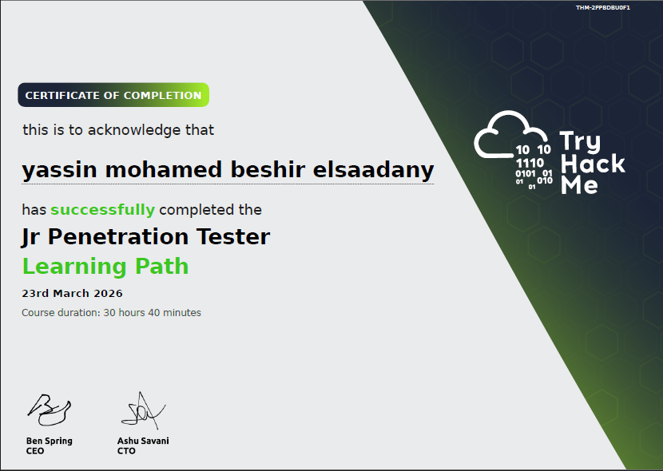
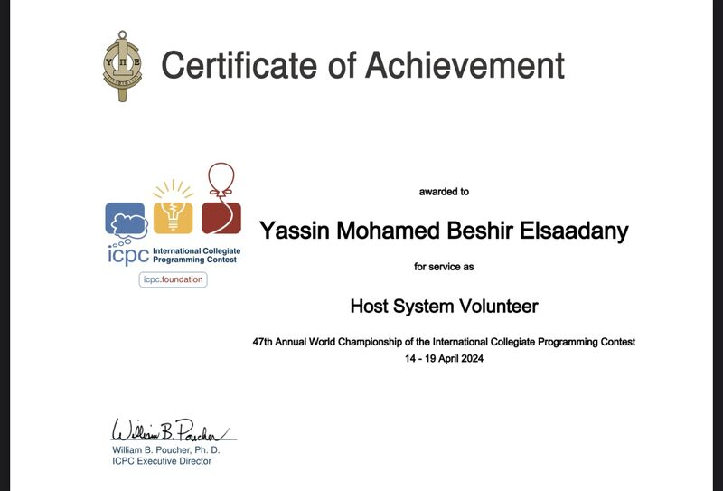
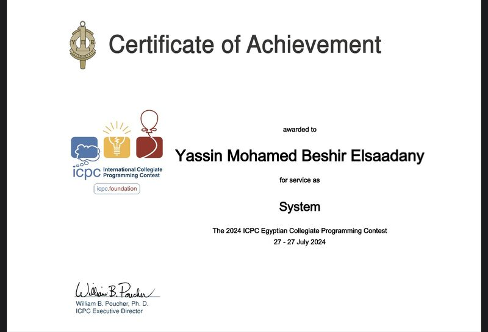

---
# 👋 Hi, I'm Yassin Elsaadany

🎓 Computer Science & Cybersecurity Student
🛡️ Web Security | Malware Analysis | Networking | Full-Stack Development
🚀 Building secure real-world applications and cybersecurity projects

---

## 🚀 Featured Project

### 🎾 PlayPadel Demo

PlayPadel is a secure e-commerce web application for padel products.

**Highlights**
- User authentication and Google OAuth
- Stripe payment integration
- Admin dashboard
- Product, order, coupon, and user management
- SQL Injection, XSS, CSRF, IDOR, and secure cookie protection

---

## 🧰 Tech Stack

---

## 🛡 Cybersecurity Focus

- Malware analysis (static & dynamic)
- Web application security
- Secure authentication systems
- Cryptography basics (AES, DES, RSA, hashing)
- Network security & firewall configuration
- Secure system design

---

## 🏆 Certificates & Experience

### 🛡 Cybersecurity

**Fortinet NSE 4 — FortiOS 7.6 Administrator**

- Enterprise firewall administration and configuration
- Security policies, NAT, VPN, and threat prevention
- Issued June 2026 via Credly

---

**TryHackMe — Jr Penetration Tester**
- Completed full penetration testing learning path
- Covers web attacks, privilege escalation, and real-world scenarios
- Hands-on labs and attack simulations

---

### 💻 ICPC System Engineering Experience

I worked as part of the **System / SysOps team** in ICPC competitions:

- Infrastructure setup and stability
- Network configuration and troubleshooting
- Real-time system monitoring
- Ensuring contest performance under pressure

#### 🏅 ACPC (Africa & Arab CPC)

#### 🏅 ICPC World Finals

#### 🏅 ECPC (Egyptian CPC)

---

## 📌 Projects

| Project | Description | Tech |
|--------|-------------|------|
| [🖐️ HearMySign Server](https://github.com/Yassin-Elsaadany/hear-my-sign-server) | Real-time ASL sign language recognition server with WebRTC video calls | Python · TensorFlow · MediaPipe · WebRTC |
| [🎾 PlayPadel Demo](https://github.com/Yassin-Elsaadany/PlayPadel-Demo) | Secure e-commerce web app with full security hardening | Flask · SQLite · Stripe · OAuth |
| [🤖 Cyber Log Classifier](https://github.com/Yassin-Elsaadany/cyber-log-text-classifier-ml) | ML model that classifies cybersecurity log entries | Python · scikit-learn · NLP |
| [☕ Distributed Ticket Booking](https://github.com/Yassin-Elsaadany/distributed-ticket-booking-rmi-mtls) | Distributed booking system with Ricart-Agrawala, Lamport clocks, and mTLS | Java · RMI · mTLS |
| [🛡️ Palo Alto GNS3 Lab](https://github.com/Yassin-Elsaadany/paloalto-gns3-security-lab) | Network security lab with firewall zones, NAT, and security policies | GNS3 · Palo Alto · Networking |

---

## 📊 GitHub Stats

---

## 📫 Contact

📧 Email: y.m.elsaadany@gmail.com

---

## ⚡ Motto

> I build systems with security first — not as an afterthought.

✻ Baked for 32s

> Y.Elsaada00673@student.aast.edu and add this and give me the updte okay

Here it is with both emails added:

# 👋 Hi, I'm Yassin Elsaadany

🎓 Computer Science & Cybersecurity Student
🛡️ Web Security | Malware Analysis | Networking | Full-Stack Development
🚀 Building secure real-world applications and cybersecurity projects

---

## 🚀 Featured Project

### 🎾 PlayPadel Demo

PlayPadel is a secure e-commerce web application for padel products.

**Highlights**
- User authentication and Google OAuth
- Stripe payment integration
- Admin dashboard
- Product, order, coupon, and user management
- SQL Injection, XSS, CSRF, IDOR, and secure cookie protection

---

## 🧰 Tech Stack

---

## 🛡 Cybersecurity Focus

- Malware analysis (static & dynamic)
- Web application security
- Secure authentication systems
- Cryptography basics (AES, DES, RSA, hashing)
- Network security & firewall configuration
- Secure system design

---

## 🏆 Certificates & Experience

### 🛡 Cybersecurity

**Fortinet NSE 4 — FortiOS 7.6 Administrator**

- Enterprise firewall administration and configuration
- Security policies, NAT, VPN, and threat prevention
- Issued June 2026 via Credly

---

**TryHackMe — Jr Penetration Tester**
- Completed full penetration testing learning path
- Covers web attacks, privilege escalation, and real-world scenarios
- Hands-on labs and attack simulations

---

### 💻 ICPC System Engineering Experience

I worked as part of the **System / SysOps team** in ICPC competitions:

- Infrastructure setup and stability
- Network configuration and troubleshooting
- Real-time system monitoring
- Ensuring contest performance under pressure

#### 🏅 ACPC (Africa & Arab CPC)

#### 🏅 ICPC World Finals

#### 🏅 ECPC (Egyptian CPC)

---

## 📌 Projects

| Project | Description | Tech |
|--------|-------------|------|
| [🖐️ HearMySign Server](https://github.com/Yassin-Elsaadany/hear-my-sign-server) | Real-time ASL sign language recognition server with WebRTC video calls | Python · TensorFlow · MediaPipe · WebRTC |
| [🎾 PlayPadel Demo](https://github.com/Yassin-Elsaadany/PlayPadel-Demo) | Secure e-commerce web app with full security hardening | Flask · SQLite · Stripe · OAuth |
| [🤖 Cyber Log Classifier](https://github.com/Yassin-Elsaadany/cyber-log-text-classifier-ml) | ML model that classifies cybersecurity log entries | Python · scikit-learn · NLP |
| [☕ Distributed Ticket Booking](https://github.com/Yassin-Elsaadany/distributed-ticket-booking-rmi-mtls) | Distributed booking system with Ricart-Agrawala, Lamport clocks, and mTLS | Java · RMI · mTLS |
| [🛡️ Palo Alto GNS3 Lab](https://github.com/Yassin-Elsaadany/paloalto-gns3-security-lab) | Network security lab with firewall zones, NAT, and security policies | GNS3 · Palo Alto · Networking |

---

## 📊 GitHub Stats

---

## 📫 Contact

📧 Personal: y.m.elsaadany@gmail.com
🎓 University: Y.Elsaada00673@student.aast.edu

---

## ⚡ Motto

> I build systems with security first — not as an afterthought.
---
