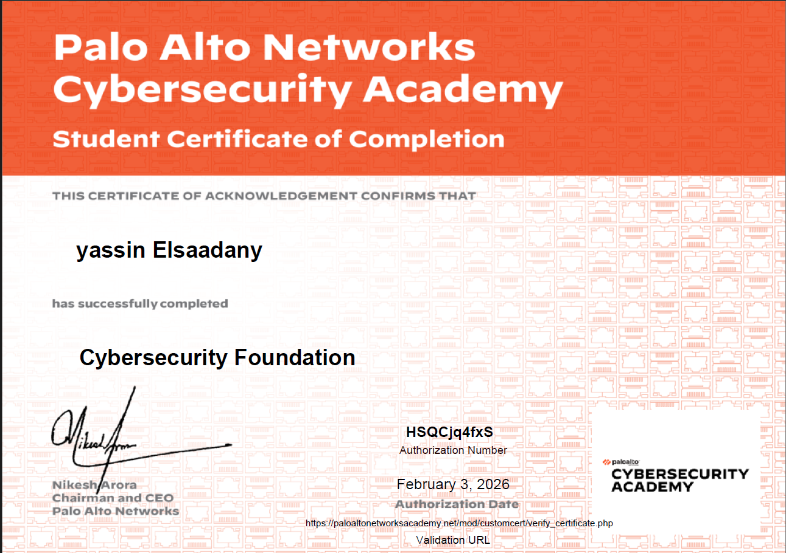

---

# 👋 Hi, I'm Yassin Elsaadany

🎓 Cybersecurity Graduate with a Computer Science Degree from AASTMT  
🛡️ Network Security | Firewall Configuration | Web Application Security  
🚀 Building secure systems, network labs, and real-world cybersecurity projects

---

## 🎓 Graduation Project

### 🖐️ HearMySign — ASL Sign Language Alphabet Recognition

HearMySign is a real-time American Sign Language alphabet recognition system that detects hand signs from images and classifies them into letters A–Z.

**What I built**
- 26-class ASL alphabet recognition model
- Image preprocessing and dataset preparation pipeline
- MediaPipe hand landmark extraction
- Train / validation / test evaluation pipeline
- Flask web demo for live testing
- GPU training environment using CUDA in WSL

**Techniques used**
- Transfer learning using EfficientNetB0 and MobileNetV3
- Fine-tuning pretrained model layers
- Hand landmark normalization
- Label smoothing
- Dropout regularization
- Data augmentation
- Classification reports and per-class evaluation

**Result**
- Achieved **98.4% accuracy** on the ASL alphabet recognition model

**Tech Stack**
- Python 3.12
- TensorFlow
- Keras
- MediaPipe
- NumPy
- scikit-learn
- Pillow
- Matplotlib
- Flask
- CUDA
- WSL

🔗 GitHub: [HearMySign Server](https://github.com/Yassin-Elsaadany/hear-my-sign-server)

---

## 📌 Projects

| Project | Description | Tech |
|--------|-------------|------|
| [🖐️ HearMySign ASL Recognition](https://github.com/Yassin-Elsaadany/hear-my-sign-server) | Graduation project for ASL alphabet recognition with model training, evaluation, and Flask live demo. | Python · TensorFlow · Keras · MediaPipe · Flask |
| [🎾 PlayPadel Demo](https://github.com/Yassin-Elsaadany/PlayPadel-Demo) | Secure Flask e-commerce demo with authentication, payments, admin dashboard, and web attack protections. | Flask · SQLite · Stripe · OAuth |
| [🤖 Cyber Log Classifier](https://github.com/Yassin-Elsaadany/cyber-log-text-classifier-ml) | Python project for classifying cybersecurity logs and common attack patterns. | Python · scikit-learn · NLP |
| [🛡️ Palo Alto GNS3 Security Lab](https://github.com/Yassin-Elsaadany/paloalto-gns3-security-lab) | Virtual network security lab with firewall zones, NAT, security policies, and traffic testing. | GNS3 · Palo Alto · Networking |
| [☕ Distributed Ticket Booking](https://github.com/Yassin-Elsaadany/distributed-ticket-booking-rmi-mtls) | Secure distributed ticket booking system using Java RMI, Mutual TLS, Lamport clocks, and Ricart-Agrawala. | Java · RMI · mTLS |

---

## 🛡 Cybersecurity Focus

- Web application security
- SQL Injection testing
- Cross-Site Scripting testing
- Brute-force testing
- Authentication and access control testing
- Network security
- Firewall policies
- NAT and VPN basics
- VLANs and Private VLANs
- Log analysis and troubleshooting
- Secure system design

---

## 🧰 Tech Stack

---

## 🌐 Network & Security Tools

---

## 🏆 Certificates & Experience

### 🛡 Cybersecurity Certifications

**Fortinet NSE 4 — FortiOS 7.6 Administrator**

- FortiGate administration and configuration
- Security policies, NAT, VPN, routing, logging, and network security
- Issued June 2026 via Credly

---

**Palo Alto Networks Cybersecurity Academy — Cybersecurity Foundation**

- Cybersecurity fundamentals and network security concepts
- Authorization Number: HSQCjq4fxS
- Issued February 2026 by Palo Alto Networks

---

**TryHackMe — Jr Penetration Tester**

- Completed penetration testing learning path
- Covered web attacks, privilege escalation, and practical security labs
- Hands-on labs and attack simulations

---

### 💻 Contest System & Network Experience

Worked as part of technical and SysOps teams in programming contest environments.

- Network setup and troubleshooting
- Cisco switch, VLAN, and Private VLAN configuration
- Firewall and access control support
- Contest PC and workstation preparation
- Monitoring using Splunk, Cacti, and log monitoring tools
- Supporting live contest infrastructure under time pressure

#### 🏅 ACPC 2024

#### 🏅 ICPC World Finals

#### 🏅 ECPC

#### 🏅 QCPC Qatar 2025

- Technical and SysOps support experience during QCPC Qatar 2025.

---

## 📊 GitHub Activity

I use GitHub to publish cybersecurity labs, secure web applications, network security projects, and graduation project work.

---

## 📫 Contact

📧 Personal: [y.m.elsaadany@gmail.com](mailto:y.m.elsaadany@gmail.com)

🎓 University: [Y.Elsaada00673@student.aast.edu](mailto:Y.Elsaada00673@student.aast.edu)

🔗 LinkedIn: [linkedin.com/in/yassin-elsadaany](https://linkedin.com/in/yassin-elsadaany)

---

## ⚡ Motto

> I build systems with security first — not as an afterthought.

---
